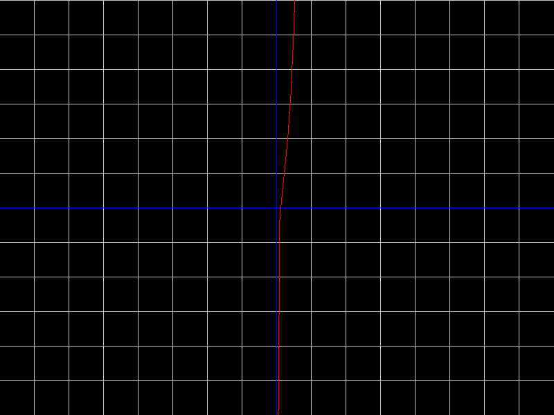

~This is a project designed to display simple 2d mathematic graphs in  a 800x600 pixes window  using sfml 

~This library is also using regex in order to recognize patterns 

~Here are some examples of this:

For -15x^3: 

Graph:

For e^5x+5log(5x)-2x^2:

