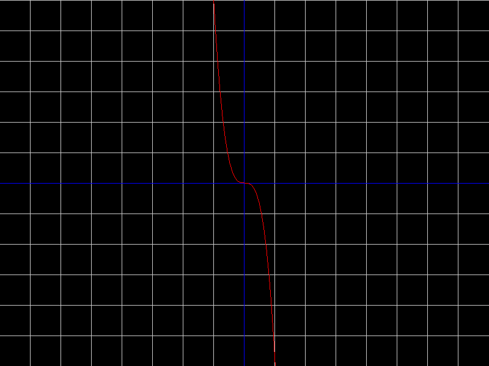
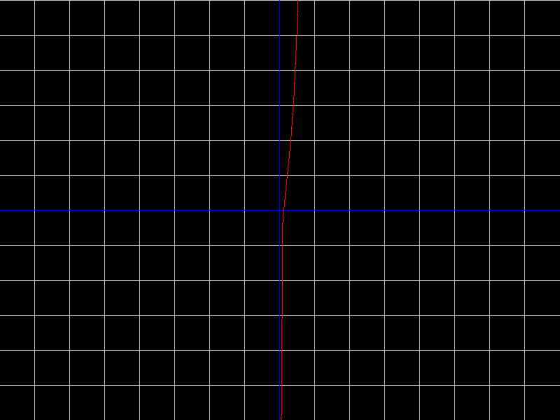
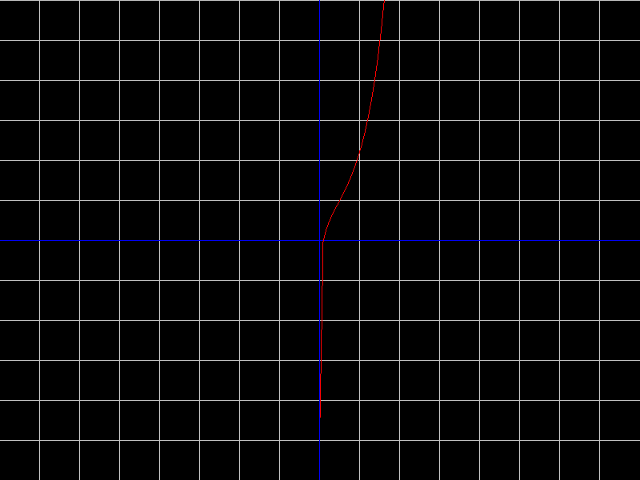

This program creates a website in a local server and takes an input function following these rules: 
~ +-ax^n (when the +,-,a is not necessary a!=0 and a belongs to Z AND Z!=0 ,n>0 and n belongs to Z)
 
~ +-ae^nx (when the +,-,a is not necessary n>0 and a belongs to Z AND Z!=0 n>0 and n belongs to Z)
 
~ +-alog(n*x) (when the +,-,a is not necessary and α belongs to Z AND Z!=0 n>0 and n belongs to Z)
 
~ +-asin(n*x) (when the +,-,a is not necessary and a belongs to Z AND Z!=0 n>0 and n belongs to Z) 
 
~ +-acos(n*x) (when the +,-,a is not necessary and a belongs to Z AND Z!=0 n>0 and n belongs to Z)
 
~ -+a^x (when the +,-,a is not necessary a>0 and a belongs to N AND N!=0)
 

~(Z is for integers)

# 🆘Use the + or - a or none of them🆘
 

and gives to the user a 2D graph that represents the function he gave. 
For -15x^3: 

Graph:

For e^5x+5log(5x)-2x^2:

For 5^x+2log(5x):

# 📦 Dependencies:

SFML 🖊 
Used for graph visualization. 
🔗 SFML License: https://www.sfml-dev.org/license.php

cpp-httplib 🌐 
Used to create and maintain the local server. 
🔗 cpp-httplib MIT License: https://github.com/yhirose/cpp-httplib/blob/master/LICENSE

# 👥CONTRIBUTORS:

~The-Mastermind1 
